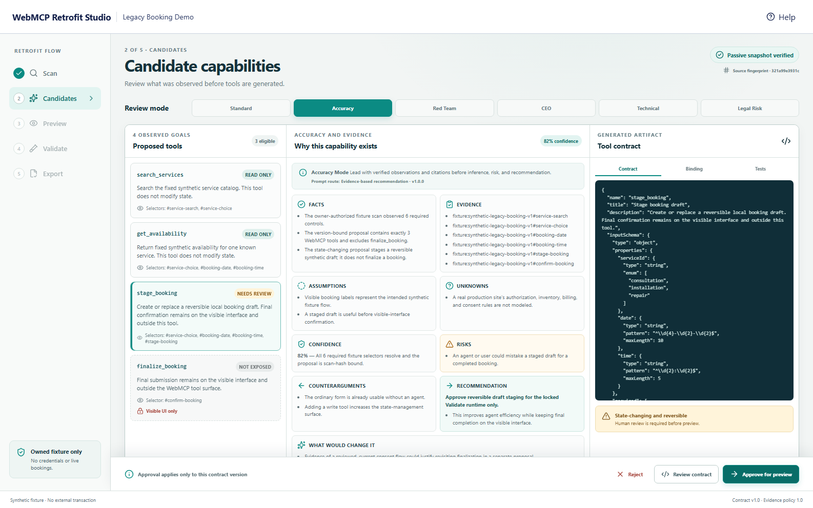
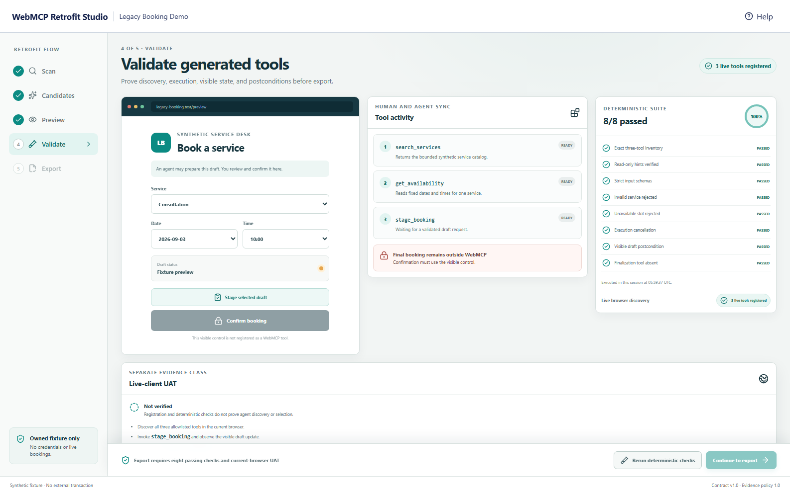
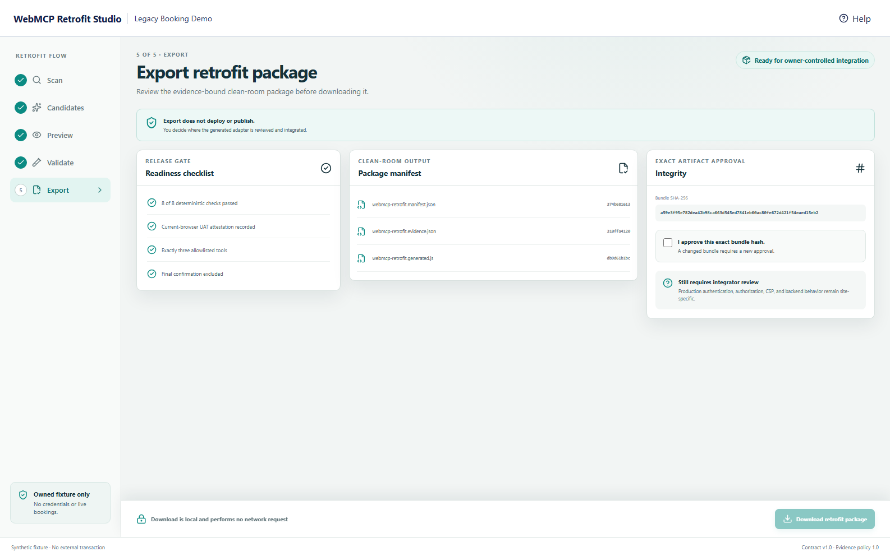

# WebMCP Retrofit Studio

WebMCP Retrofit Studio is a local, synthetic product prototype for turning an owner-authorized website workflow into narrow, reviewable browser-agent tools. The connected experience carries evidence through five guarded stages: **Scan → Candidates → Preview → Validate → Export**.

The implemented fixture is intentionally bounded. It does not scan arbitrary third-party websites, request credentials, contact a booking provider, create a real booking, deploy generated code, or publish a challenge submission.

## Product flow

1. **Scan owned fixture** requires an explicit authorization check, then parses a bundled synthetic HTML snapshot inertly. The scanner rejects its configured prohibited active tags, URL-bearing attributes, event-handler attributes, and password inputs; makes zero external requests; executes no scripts; retains no raw form values; and records six semantic observations plus a SHA-256 source fingerprint.
2. **Candidate capabilities** maps those observations to exactly three eligible contracts: `search_services`, `get_availability`, and `stage_booking`. It keeps `finalize_booking` outside the agent surface and explains the proposal through facts, evidence, assumptions, unknowns, confidence, risks, counterarguments, tradeoffs, and change conditions.
3. **Preview generated retrofit** binds the approved three-tool allowlist to proposal and implementation-version hashes. The preview must match the exact proposal; partial approval and out-of-order transitions fail closed.
4. **Validate generated tools** activates the reviewed three-tool runtime only after the version is locked on Validate, preserves the ordinary booking interface, and runs eight deterministic checks in the current browser session. `stage_booking` updates every visible draft field, while final confirmation remains a separate visible-interface action.
5. **Export retrofit package** requires a passing validation and the current-browser UAT attestation, then builds a deterministic clean-room package. After the owner approves the exact bundle hash, the browser revalidates every artifact digest and the complete canonical payload before downloading one local JSON package containing a manifest, evidence record, generated registration source, and per-file SHA-256 digests. Downloading performs no network request and does not deploy or publish anything.

## What works

- Scans only the bundled, entrant-controlled synthetic fixture and retains metadata instead of raw HTML or customer values.
- Produces stable scan, proposal, version, file, and bundle hashes with Web Crypto SHA-256.
- Invalidates every downstream approval, preview, validation, and export receipt when the fixture is rescanned. Rejecting or changing an earlier gate likewise clears dependent artifacts.
- Registers exactly three top-level imperative WebMCP tools only on the locked Validate stage:
  - `search_services`
  - `get_availability`
  - `stage_booking`
- Reuses the same fixed booking validation for the visible interface and tool handlers.
- Keeps `finalize_booking` outside the WebMCP inventory. Final confirmation is available only through the visible interface.
- Preserves an ordinary booking interface when `document.modelContext` is unavailable.
- Runs eight deterministic checks and shows no pass score before they execute.
- Keeps deterministic results separate from live-client proof. The in-app UAT control records an operator attestation; it does not by itself prove that an agent discovered, selected, and executed the live site tools.
- Supports Standard, Accuracy, Red Team, CEO, Technical, and Legal Risk review modes.
- Validates a nine-section response-quality envelope and centralizes eight versioned review prompts.
- Provides responsive desktop and mobile product views derived from locally reviewed design references. Those source references remain local-only; public release evidence uses screenshots generated from this build.

## Safety and authority boundary

This repository uses only browser-local synthetic services, schedules, snapshots, and drafts. It requests no credentials, fetches no third-party page, and calls no external booking service.

Discovery is not a universal website copier. `scanOwnedFixture` accepts no URL and parses only the frozen `synthetic-legacy-booking-v1` snapshot. Capability inference re-derives the trusted scan, requires every expected observation, and refuses metadata that is not bound to that snapshot. The generated adapter is metadata-only and still requires an owner-reviewed, same-origin execution binding before production integration.

Tool input is revalidated during execution. Schemas reject additional properties. Read tools carry `readOnlyHint: true`; every tool marks returned synthetic/page-derived content with `untrustedContentHint: true`. An owner-controlled registration `AbortSignal` removes the tool group immediately when Validate is left, even if a registration promise is still pending. Each callback honors a separate client execution-cancellation signal when the bridge supplies one. The compatibility fallback for an omitted signal is limited to synchronous, browser-local handlers; draft validation, the visible-state callback, and the store commit still share one pre-commit boundary so a rejected or supplied-signal-cancelled callback does not leave a committed draft.

The confirmation control requires a currently staged draft and displays its exact values before the final click. “Confirmed through visible UI” describes the interaction path; it is not proof of human presence. A separate computer-use agent could still operate ordinary visible controls.

## Evidence lifecycle

```text
owner authorization
        │
        ▼
inert bundled-fixture scan ── SHA-256 scan hash
        │
        ▼
evidence-bound candidate proposal ── proposal + version hashes
        │
        ▼
exact three-tool approval
        │
        ▼
hashed preview
        │
        ▼
deterministic validation + separate live-client UAT gate
        │
        ▼
owner-approved local export ── manifest + evidence + generated code + digests
```

A new scan increments the workflow revision and clears approval, preview, validation, and export state. Export re-infers the trusted proposal and rejects stale or mismatched artifacts before creating the package.

## Product screenshots

These release screenshots were generated from the verified local production-mode build; they contain no account, customer, or credential data.







## WebMCP runtime

The adapter feature-detects `document.modelContext.registerTool` and registers from the top-level page. That matches the current [OpenAI Site Tools guidance](https://learn.chatgpt.com/docs/webmcp), whose built-in browser support does not currently discover declarative or iframe-registered tools. Registration cleanup and callback cancellation follow the current [Chrome imperative API](https://developer.chrome.com/docs/ai/webmcp/imperative-api), and annotations/output limits follow [Chrome's WebMCP security guidance](https://developer.chrome.com/docs/ai/webmcp/secure-tools).

The approval and Preview views serialize the same deeply frozen contract objects used during runtime registration. The generated export source contains an explicit top-level `document.modelContext.registerTool` loop, a caller-owned registration signal, a disposer, and a pre-dispatch execution-cancellation check; it delegates execution to an owner-reviewed adapter rather than synthesizing remote or arbitrary code. For asynchronous or state-changing integrations, that adapter must honor the supplied client signal transactionally. The wrapper does not relabel a completed adapter outcome if cancellation or registration cleanup races its return.

Mocked registration, deterministic browser-session checks, and Chromium E2E tests verify local application behavior. A separate [local in-app-browser receipt](docs/evidence/local-webmcp-uat-2026-09-02.md) verifies real local WebMCP discovery and execution. None of those checks establish that the final public URL is reachable or identical; release evidence requires repeating [`docs/live-webmcp-uat.md`](docs/live-webmcp-uat.md) against the deployed revision.

## Architecture

Key modules:

- `src/fixtures/legacyBookingSnapshot.ts` — frozen synthetic HTML fixture and ownership metadata.
- `src/discovery/scanOwnedFixture.ts` — inert parsing, prohibited-content checks, evidence observations, canonical JSON, and SHA-256 helpers.
- `src/discovery/inferCapabilities.ts` — complete-evidence gate, exact capability mapping, excluded finalization, and proposal/version hashes.
- `src/workflow/retrofitWorkflow.ts` — five-stage state machine, guarded transitions, rescan invalidation, validation, and export receipts.
- `src/export/buildExportBundle.ts` — deterministic manifest, evidence record, generated registration source, file digests, and bundle hash.
- `src/domain/booking.ts` — fixed catalog, availability, input validation, and reversible draft store.
- `src/webmcp/bookingToolContracts.ts` — shared, reviewable metadata and strict schemas used by approval, preview, export, and registration.
- `src/webmcp/registerBookingTools.ts` — exact tool allowlist, callbacks, revalidation, cancellation, and cleanup.
- `src/quality/responseQuality.ts` — six modes and runtime quality validation.
- `src/quality/promptTemplates.ts` — eight versioned system/developer prompt pairs.
- `src/quality/reviewModes.ts` — mode-to-prompt routing, emphasis, and nine-section presentation order.
- `src/validation/runDeterministicChecks.ts` — eight browser-session checks and their evidence report.
- `src/App.tsx` — connected Scan/Candidates/Preview/Validate/Export interface and lifecycle integration.

## Run locally

Requirements: Node.js 24 is verified locally; another runtime must satisfy the locked dependencies.

```powershell
npm install
npm run dev
```

The app uses no API key and requires no backend.

## Verify

```powershell
npm install
npx --no-install playwright install chromium
npm run verify
```

On a fresh Linux CI runner, install Chromium and its system dependencies with `npx --no-install playwright install --with-deps chromium`. The verifier runs type checking, unit/component tests, coverage, production builds, Playwright E2E, and the dependency audit. The suites cover the booking domain, inert discovery, capability inference, workflow ordering and stale-artifact invalidation, deterministic export, WebMCP registration and cancellation, UI behavior, response-quality contracts, review-mode routing, repository placeholder hygiene, runtime checks, and desktop/mobile browser journeys. `npm run test:e2e` first rebuilds the app, starts a fresh local preview, and saves Playwright evidence under the ignored `test-results/` directory.

## Documentation and design evidence

- [AI response quality framework](docs/ai-response-quality-framework.md)
- [Live WebMCP UAT protocol](docs/live-webmcp-uat.md)
- [Passing local WebMCP UAT receipt](docs/evidence/local-webmcp-uat-2026-09-02.md)
- [Local release-candidate receipt](docs/submission/local-release-candidate-receipt.md)
- [Devpost-ready description](docs/submission/devpost-description.md)
- [Judge testing instructions](docs/submission/testing-instructions.md)
- [Submission checklist](docs/submission/submission-checklist.md)
- [Judge-facing final audit](docs/submission/judge-final-audit.md)
- [Public-release approval packet](docs/submission/public-release-approval-packet.md)
- [Asset provenance inventory](docs/submission/asset-provenance.md)
- [Demo script and storyboard](docs/submission/demo-script-storyboard.md)
- [Design fidelity ledger](docs/design/fidelity-ledger.md)
- Runtime screenshots under `docs/screenshots/` are regenerated from the reviewed build before public release.

The local accepted/concept PNGs are design references, not runtime proof, and are explicitly excluded from the public repository because their redistribution provenance is not established. See the provenance inventory for the release boundary.

## Public-release status

The connected five-step product, local test suites, documentation, and submission drafts exist in this workspace. The following required challenge artifacts remain pending until they are approved, published, and independently read back:

- public repository and approved open-source license;
- public live deployment;
- live WebMCP UAT against that deployment;
- final narrated video and public YouTube URL; and
- final Devpost payload and submission.

No deployment, public repository, public video, live-client success, or challenge submission is implied by this local implementation.
